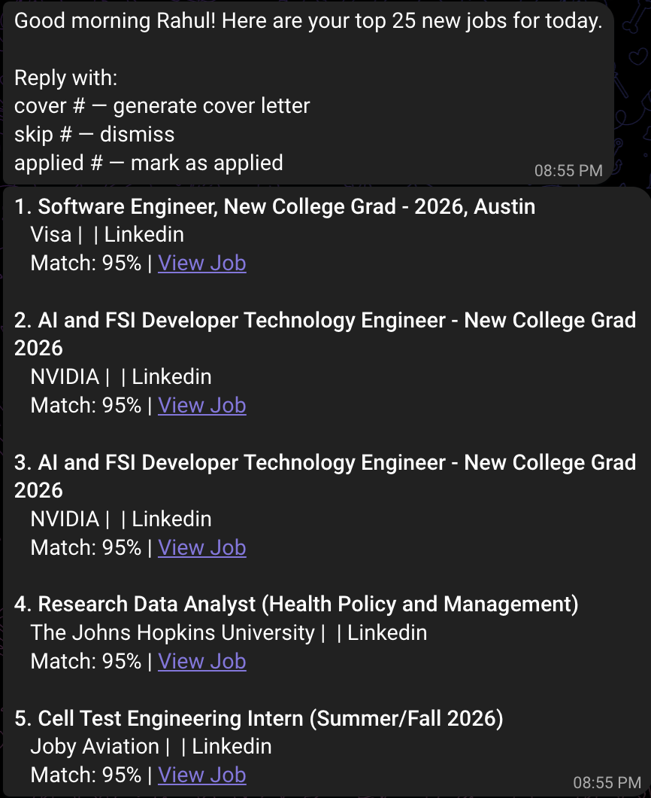

# Job Bot

An automated job search pipeline that scrapes listings daily, scores them against your resume, generates tailored cover letters with Claude AI, and delivers your top matches via Telegram or WhatsApp.

## Demo



## Results

First run scraped **655 jobs** across LinkedIn and Indeed, with match scores ranging from 0–95%. Top match scored 95% against resume. Average match score was 63%. Cover letters generated in under 10 seconds via Claude API.

## What it does

1. **Scrapes** jobs from LinkedIn, Indeed, ZipRecruiter, and Handshake
2. **Scores** each listing against your resume using TF-IDF similarity
3. **Filters** by work authorization requirements
4. **Notifies** you of top matches via Telegram (or WhatsApp/Twilio)
5. **Generates** cover letters on demand using Claude (Anthropic API)
6. **Applies** automatically via LinkedIn Easy Apply (optional, Playwright-based)
7. **Tracks** all applications in a Supabase database

Runs on a daily GitHub Actions schedule or locally on demand.

## Stack

- **Scraping:** [JobSpy](https://github.com/Bunsly/JobSpy), Playwright (Handshake)
- **AI:** Claude (Anthropic API) — cover letters and open-ended form answers
- **Database:** Supabase (PostgreSQL)
- **Notifications:** Telegram Bot API / Twilio WhatsApp
- **Deployment:** Vercel (webhook), GitHub Actions (daily scheduler)

## Setup

### 1. Clone and install

```bash
git clone https://github.com/yourusername/job-bot.git
cd job-bot
pip install -r requirements.txt
playwright install chromium
```

### 2. Configure your profile

```bash
# Copy the template and fill in your details
cp data/qa_profile_template.yaml data/qa_profile.yaml
cp data/resume_template.txt data/resume.txt
```

Edit `data/qa_profile.yaml` with your personal info — this drives the LinkedIn auto-filler and Claude prompts. Edit `data/resume.txt` with your full resume text.

Both files are gitignored and will never be committed.

### 3. Set environment variables

```bash
cp .env.example .env
```

Fill in `.env`:

| Variable | Where to get it |
|---|---|
| `ANTHROPIC_API_KEY` | [console.anthropic.com](https://console.anthropic.com) |
| `TELEGRAM_BOT_TOKEN` | [@BotFather](https://t.me/BotFather) on Telegram |
| `TELEGRAM_CHAT_ID` | Send a message to your bot, then call `getUpdates` |
| `SUPABASE_URL` | Your Supabase project settings |
| `SUPABASE_KEY` | Your Supabase anon key |
| `LINKEDIN_EMAIL` | Your LinkedIn login (for Easy Apply automation) |
| `LINKEDIN_PASSWORD` | Your LinkedIn password |

### 4. Set up the database

Run `tracker/setup_supabase.sql` in your Supabase SQL editor to create the jobs table.

### 5. Run manually

```bash
python -m scheduler.daily_run
```

### 6. GitHub Actions (daily schedule)

Add all `.env` variables as GitHub repository secrets. The workflow at `.github/workflows/daily_scrape.yml` runs automatically at 10 AM CDT.

## Project structure

```
job-bot/
├── scrapers/          # Job scraping (JobSpy + Handshake)
├── matcher/           # TF-IDF scoring against your resume
├── generator/         # Claude cover letter generation
├── applier/           # LinkedIn Easy Apply automation (Playwright)
├── bot/               # Telegram and WhatsApp notification clients
├── tracker/           # Supabase database client and schema
├── scheduler/         # Daily orchestrator
├── api/               # Vercel webhook for bot commands
└── data/              # Your resume.txt and qa_profile.yaml (gitignored)
```

## Customizing job search

Edit the search parameters in `scrapers/jobspy_scraper.py` — roles, locations, experience level, remote preference, and sites to scrape.

## Built by

**Rahul Raja Durai Murugan**

BS Biomedical Engineering, UT Austin · MS Engineering Data Science & AI, University of Houston (incoming)

Built to automate my own job search during graduation. Open to data science, ML, and software engineering roles.

[LinkedIn](https://linkedin.com/in/rahulrajadm) · [GitHub](https://github.com/rahulrajadm) · rahulrdm13@gmail.com

## License

MIT
